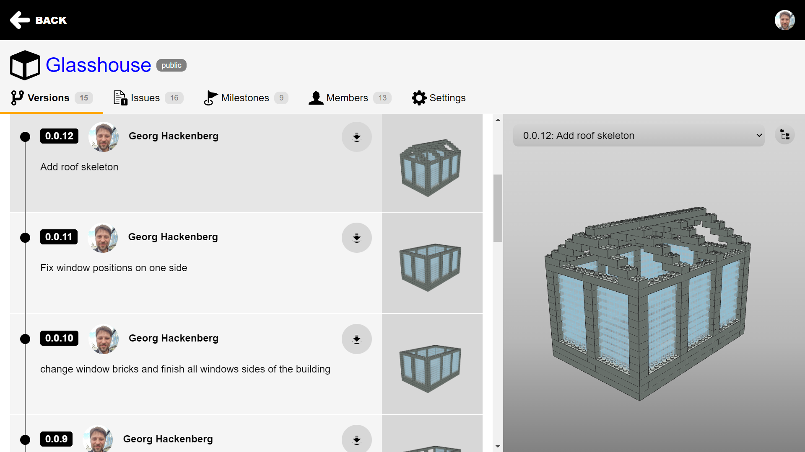

# ProductBoard

ProductBoard provides a free and open source solution for collaborative product design. We support version management for CAD models, as well as issue management and milestone management. In issues, you can refer to parts and assemblies of CAD models through markdown references. The references help making the discussion more self-explanatory and easy to understand.

## Screenshots

### 📷 Versions view

The versions view shows the history of the CAD models that have been developed for the product.



### 📷 Issues view

The issues view provides an overview of open and closed issues for the product design team.


### 📷 Comments view

The comments view enables discussion between stakeholders and engineers around issues.


## Tools

ProductBoard requires the following tools:

- node@^16
- npm@^8

## Variables

### **Backend** variables

Copy the variables file:

```
packages/backend/src/env.example.ts -> packages/backend/src/env.ts
```

Edit the variables:

```ts
export const AUTH0_JWKS_URI = 'Your_Auth0_JWKS_URI'
export const AUTH0_JWKS_KID = 'Your_Auth0_JWKS_KID'
```

### **Frontend** variables

Copy the variables file:

```
packages/frontend/src/scripts/env.example.ts -> packages/frontend/src/scripts/env.ts
```

Edit the variables:

```ts
export const AUTH0_DOMAIN    = 'Your_Auth0_Domain'
export const AUTH0_CLIENT_ID = 'Your_Auth0_Client_ID'
export const AUTH0_AUDIENCE  = 'Your_Auth0_API_Audience'
```

## Scripts

The software provides the following scripts:

### 📄 Install dependencies

Install third party dependencies as follows:

```
npm install
```

### 📄 Start development

Start the software in development mode as follows:

```
npm run devel
```

### 📄 Start production

Start the software in production mode as follows:

```
npm run clean
npm run build
npm start
```

## Diagrams

### 📊 Package structure

The software exhibits the following package structure:


### 📊 Entity structure

The software implements the following entity structure:


## Packages

The software comprises the following packages:

* [Common](packages/common/README.md)
* [Database](packages/database/README.md)
* [Toolkit](packages/toolkit/README.md)
* [Broker](packages/broker/README.md)
* [Backend](packages/backend/README.md)
* [Worker](packages/worker/README.md)
* [Frontend](packages/frontend/README.md)
* [Gateway](packages/gateway/README.md)

## Documenations

Here are some more resources to read through:

* [License](LICENSE.md)
* [Changelog](CHANGELOG.md)
* [Contributing](CONTRIBUTING.md)
