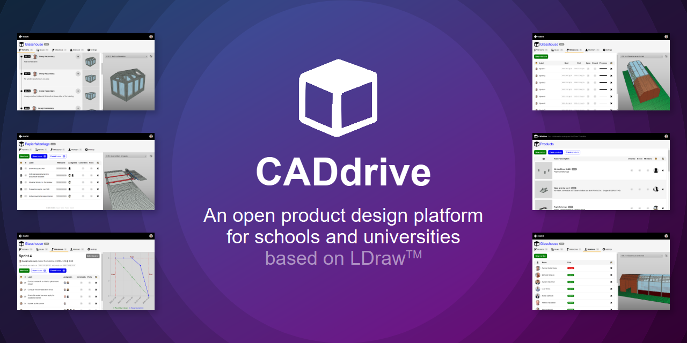
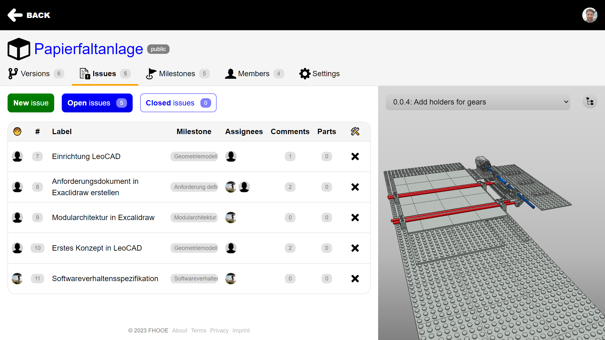
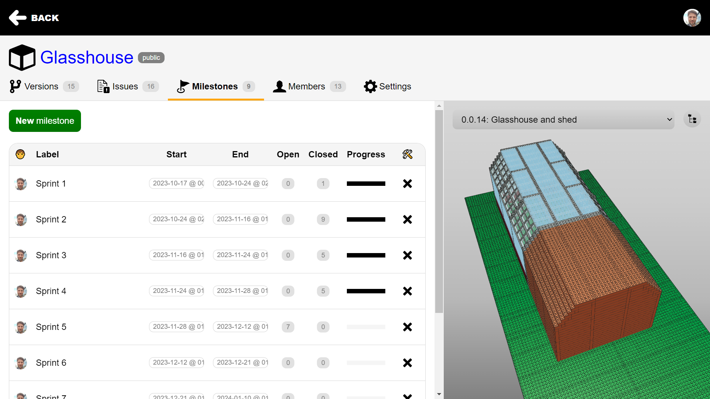
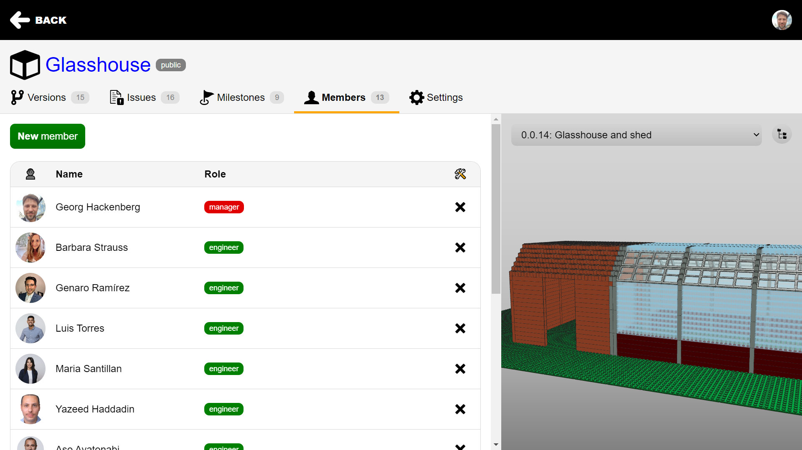
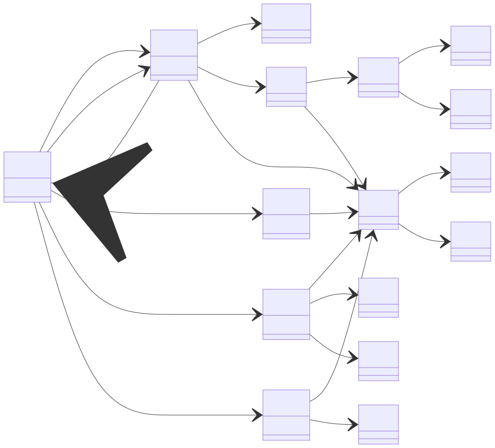
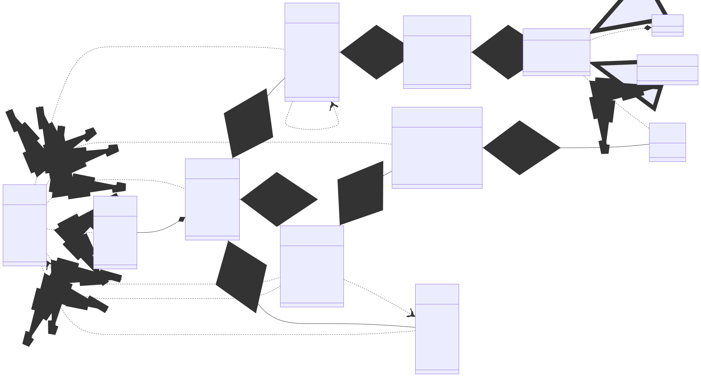

# CADdrive



**CADdrive** (see https://caddrive.org and https://caddrive.com) provides an **open source** solution for **collaborative product design**. In the most recent version our platform supports ...

- **member management** for assigning access permissions on product data to our users (using a role-based access control paradigm),
- **version management** for tracking the evolution of CAD models (currently in [LDraw format](https://ldraw.org/) or [GLTF format](https://www.khronos.org/gltf/), but extensible to other formats as well),
- **issue management** for task specification and discussion among stakeholders, as well as assignment to project members, and
- **milestone management** for scheduling task execution and tracking completion across the design project (using time boxing).

In **issue discussions**, you can refer to parts and assemblies of CAD models through **Markdown references**. The references help making the discussion more self-explanatory and easy to understand.

## 👨‍🎓 Publications

You can read more about **CADdrive** in the following publications:

### GitHub for product development - How could that look like? `@ ICED 2023`

Read at [Cambridge University Press](https://www.cambridge.org/core/journals/proceedings-of-the-design-society/article/github-for-product-development-how-could-that-look-like/58A5D7A0055D00FA7C265D48C7A2A24F) or cite with our **BibTex entry**:

```bibtex
@article{hackenberg_zehetner_frühwirth_2023,
  title     = {GITHUB FOR PRODUCT DEVELOPMENT - HOW COULD THAT LOOK LIKE?},
  volume    = {3},
  DOI       = {10.1017/pds.2023.206},
  journal   = {Proceedings of the Design Society},
  publisher = {Cambridge University Press},
  author    = {Hackenberg, Georg and Zehetner, Christian and Frühwirth, Dominik},
  year      = {2023},
  pages     = {2055–2064}
}
```

## 📷 Screenshots

In the following, we provide screenshots of different views inside **CADdrive**:

- **Product overview**
- **Version overview**
- **Issue overview** and **issue detail view**
- **Milestone overview** and **milestone detail view**
- **Member overview**

### Product overview

The **product overview** provides an overview of public and private product design projects on the platform.


### Version overview

The **version overview** shows the history of the CAD models that have been developed for the product.


### Issue overview

The **issue overview** provides an overview of open and closed issues for the product design team.



### Issue detail view

The **issue detail view** enables discussion between stakeholders and engineers around issues.


### Milestone overview

The **milestone overview** provides an overview of the time schedule for the product design project.



### Milestone detail view

The **milestone detail view** provides an overview over the open and closed issues as well as a burn down chart.


### Member overview

The **member overview** provides an overview the team members of the product design project and their roles.



## 📃 Requirements

**CADdrive** requires the following tools:

- node@^16
- npm@^9

## 👩‍💻 Scripts

The software provides the following scripts:

### Install dependencies

Install third party dependencies as follows:

```bash
cd <CADdrive>/packages/node

npm install
```

### Start development

Start the software in development mode as follows:

```bash
cd <CADdrive>/packages/node

npm run dev
```

### Start production

Start the software in production mode as follows:

```bash
cd <CADdrive>/packages/node

npm run clean
npm run build

# Mail configuration

export SMTP_HOST=<host name or IP address>
export SMTP_PORT=<port number>
export SMTP_SECURE=<true|false>
export SMTP_AUTH_USER=<user name>
export SMTP_AUTH_PASS=<password>

# Database configuration

export TYPEORM_TYPE=<sqlite|postgres>
# ... for sqlite
export TYPEORM_DATABASE=<path to sqlite database file>
# ... for postgres
export TYPEORM_HOST=<host name or IP address>
export TYPEORM_PORT=<port number>
export TYPEORM_DATABASE=<database name>
export TYPEORM_USERNAME=<user name>
export TYPEORM_PASSWORD=<passwpord>

npm start
```

## 📊 Diagrams

In the following, we explain different structures implemented in **CADdrive**:

- **Package structure** (**reduced** and **extended**)
- **Entity structure**
- **Model structure**

### Package structure

The software exhibits the following package structure:

#### Reduced

This is a reduced version of the diagram:


#### Extended

This is an extended version of the diagram:



### Entity structure

The software implements the following entity structure:



### Model structure

The software implements the following model structure:


## 📁 Folders

This repository contains the following folders:

* [Diagrams](diagrams) contains the diagrams shown before
* [Manuscripts](manuscripts) contains manuscripts submitted for publication
* [Packages](packages) contains the actual software code behind CADdrive
* [Services](services) contains additional services of the CADdrive platform
* [Screenshots](screenshots) contains the screenshots shown before

## 📑 Documents

Here are some more resources to read through:

* [License](LICENSE.md)
* [Changelog](CHANGELOG.md)
* [Contributing](CONTRIBUTING.md)
