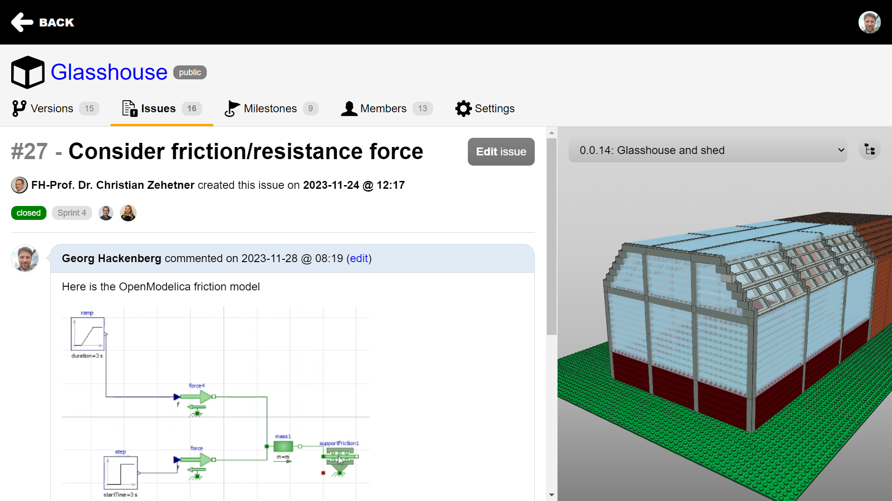

# CADdrive

**CADdrive** (see https://caddrive.org and https://caddrive.com) provides an open source solution for collaborative product design. We support version management for CAD models, as well as issue management and milestone management. In issues, you can refer to parts and assemblies of CAD models through markdown references. The references help to make the discussion more self-explanatory and easy to understand.

## Publications

You can read more about **CADdrive** in the following publications:

### 👨‍🎓 GitHub for product development - How could that look like? (ICED 2023)

Read at [Cambridge University Press](https://www.cambridge.org/core/journals/proceedings-of-the-design-society/article/github-for-product-development-how-could-that-look-like/58A5D7A0055D00FA7C265D48C7A2A24F) or cite with our BibTex entry:

```bibtex
@article{hackenberg_zehetner_frühwirth_2023,
  title     = {GITHUB FOR PRODUCT DEVELOPMENT - HOW COULD THAT LOOK LIKE?},
  volume    = {3},
  DOI       = {10.1017/pds.2023.206},
  journal   = {Proceedings of the Design Society},
  publisher = {Cambridge University Press},
  author    = {Hackenberg, Georg and Zehetner, Christian and Frühwirth, Dominik},
  year      = {2023},
  pages     = {2055–2064}
}
```

## Screenshots

### 📷 Versions view

The versions view shows the history of the CAD models that have been developed for the product.


### 📷 Issues view

The issues view provides an overview of open and closed issues for the product design team.


### 📷 Comments view

The comments view enables discussion between stakeholders and engineers around issues.



## Diagrams

### 📊 Package structure

The software exhibits the following package structure:

#### Reduced

This is a reduced version of the diagram:


#### Extended

This is an extended version of the diagram:


### 📊 Entity structure

The software implements the following entity structure:


### 📊 Model structure

The software implements the following model structure:


## Requirements

**CADdrive** requires the following tools:

- node@^16
- npm@^9

## Scripts

The software provides the following scripts:

### 📄 Install dependencies

Install third party dependencies as follows:

```
npm install
```

### 📄 Start development

Start the software in development mode as follows:

```
npm run dev
```

### 📄 Start production

Start the software in production mode as follows:

```
npm run clean
npm run build

# Mail configuration

export SMTP_HOST=<host name or IP address>
export SMTP_PORT=<port number>
export SMTP_SECURE=<true|false>
export SMTP_AUTH_USER=<user name>
export SMTP_AUTH_PASS=<password>

# Database configuration

export TYPEORM_TYPE=<sqlite|postgres>
# ... for sqlite
export TYPEORM_DATABASE=<path to sqlite database file>
# ... for postgres
export TYPEORM_HOST=<host name or IP address>
export TYPEORM_PORT=<port number>
export TYPEORM_DATABASE=<database name>
export TYPEORM_USERNAME=<user name>
export TYPEORM_PASSWORD=<passwpord>

npm start
```

## Folders

This repository contains the following folders:

* [Diagrams](diagrams) contains the diagrams shown before
* [Manuscripts](manuscripts) contains manuscripts submitted for publication
* [Packages](packages) contains the actual software code behind CADdrive
* [Screenshots](screenshots) contains the screenshots shown before

## Documents

Here are some more resources to read through:

* [License](LICENSE.md)
* [Changelog](CHANGELOG.md)
* [Contributing](CONTRIBUTING.md)
